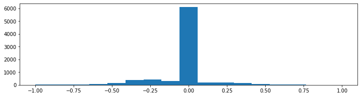

### Behavioral Cloning Project

This project is a part of:  
 [](http://www.udacity.com/drive)

Main task of the project is to prepare model in [Keras](https://keras.io/) framework to drive a car inside simulator made by Udacity available in [this repo](https://github.com/udacity/self-driving-car-sim).
# Simulator

The simulator is not an app as I expected from the start.  
To run simulator it was needed to :
- Get [Unity framework](https://unity.com/) (Individual/Personal version was working fine)
- Use [git-lfs](https://help.github.com/en/github/managing-large-files/installing-git-large-file-storage) to get repository
- Fix deprecated code inside simulator [Assets/Standard Assets/Cameras/Scripts/TargetFieldOfView.cs](https://github.com/udacity/self-driving-car-sim/blob/master/Assets/Standard%20Assets/Cameras/Scripts/TargetFieldOfView.cs#L62) - 
```C#
if (!((r is TrailRenderer) || (r is ParticleRenderer) || (r is ParticleSystemRenderer)))
```

the "(r is ParticleRenderer)" check was deleted and  other stayed untouched so after change it stated:  

```C#
if (!((r is TrailRenderer) || (r is ParticleSystemRenderer)))
```

The simulator was ready to go:


# Data Collection
I decided to collect drive data myself. It is qite challanging to drive car in the simulator - once you turn badly it gets even worse fast. After two learning circles I started recording.

One recordings clock-wise and two counter-clock-wise were recorder as the data for training.

# Data Exploration

The data is very unbalanced. Most of the times car ges straight. Linear data histogram is:  



To be able to tell more about the data log scale was applied to y-axis:  


Since in training dataset there were mostly left-turns it is visible that negative values occur a bit more frequent.  

# Data Preprocessing
To cut off areas that should not affect the driving I calculated *'the mean frame'* of all recordings. Then Region Of Interest was marked.


Data was normalized to range [-1;1]

# Side images

The simulator generates images from three points:
- center of a car
- left side of a car
- right side of a car
All camera look forward.

A trick was used to extend dataset.
All side images look like they need turn in tenrms of 'cneter camera' so they were used as samples requiring turning. Used coefficient for those cameas was equal to **0.2**.

# Data split

Classic data split to train/val/test subset is questionable for gathered data. Even though it was considered I firstly tried without this split to check how model will behave.

Reason why the data split is questionable is that gathered data differ in each iteration. No driver can reproduce *EXACT* the same results each circle so no real *GRAOUND TRUTH* can be easily found. 

That's why validation of model will be mane not in terms of validation metrics but in terms of visual result for this case.

Dropout layer has been introduced to keep model from overfitting.

# Metrics

Main metric used in training was *mean squared error (MSE)*. While having angle data collected from keyboard presses it has local peaks when driver decided to 'fix' the driving angle so exact match is also questionable. It also makes MSE metric hard to interpret.

The main question that readabe metric must answer is 'does the car fix the angle when it should'.

Also the 'accuracy' is the simplies metric to understand. 

Theresore I created metric that will tell me how the model behaves.

All possible rangel of values (between 1 and -1) were split into bins. Odd number of bins makes "zero value"(go stright) always fall into same bin. Number 17 was chosen as the bin number. Therefore the bins are ranges:

```bash
[-1.        , -0.88235294],
[-0.88235294, -0.76470588],
[-0.76470588, -0.64705882],
[-0.64705882, -0.52941176],
[-0.52941176, -0.41176471],
[-0.41176471, -0.29411765],
[-0.29411765, -0.17647059],
[-0.17647059, -0.05882353],
[-0.05882353,  0.05882353],

[ 0.05882353,  0.17647059],

[ 0.17647059,  0.29411765],
[ 0.29411765,  0.41176471],
[ 0.41176471,  0.52941176],
[ 0.52941176,  0.64705882],
[ 0.64705882,  0.76470588],
[ 0.76470588,  0.88235294],
[ 0.88235294,  1.        ]
```

The accuracy is considered as how many turning angles fall into the right bin. That makes accuracy with value freedom of **+/-0.059** . So about **+/- 3%** (6% right and 6% left) of range error is tolerable.

# Model

The size of processed image (after cropping) is 320x70 pixels in 3 channels. Classig models with convolution and pooling blocks could easily shring this height of 70 to very small number. Therefore model with no max-pooling layers was created.

The model contains:
- 3 convolution layers to extract low and high level features
- global pooling layer to average existance of features on image
- 2 dense layers to regress angle value

**Details**:


**List of layers**:  
- Normalize
- Crop2D 
- Conv2d with 5x5 kernel, padding valid, ReLU activation 
- Conv2d with 3x3 kernel, padding valid, ReLU activation 
- Conv2d with 3x3 kernel, padding valid, ReLU activation 
- Conv2d with 3x3 kernel, padding valid, ReLU activation 
- Global Average Pooling
- Dense with ReLU activation
- (Dropout) with rate 0.5 used during training
- Dense without activation 

```bash
_________________________________________________________________
Layer (type)                 Output Shape              Param #   
=================================================================
lambda_15 (Lambda)           (None, 160, 320, 3)       0         
_________________________________________________________________
cropping2d_15 (Cropping2D)   (None, 70, 320, 3)        0         
_________________________________________________________________
conv2d_36 (Conv2D)           (None, 66, 316, 16)       1216      
_________________________________________________________________
conv2d_37 (Conv2D)           (None, 64, 314, 32)       4640      
_________________________________________________________________
conv2d_38 (Conv2D)           (None, 62, 312, 64)       18496     
_________________________________________________________________
conv2d_39 (Conv2D)           (None, 60, 310, 128)      73856     
_________________________________________________________________
global_average_pooling2d_14  (None, 128)               0         
_________________________________________________________________
dense_23 (Dense)             (None, 32)                4128      
_________________________________________________________________
dropout_22 (Dropout)         (None, 32)                0      
_________________________________________________________________
dense_24 (Dense)             (None, 1)                 33        
=================================================================
Total params: 102,369
Trainable params: 102,369
Non-trainable params: 0
```

Number of parameters is still low so the model is able to work on CPU with reasonable speed after training. Model size saved on disk is 436 KB


# Training

Training was peformed using:
- 100 epochs
- Adam Optimizer with starting learning rate equal to 0.001
- Mean Squared Error Loss
- ReduceOnPlateau learning rate scheduler with factor of 0.2 and patience of 2 epochs (considering loss value)

Big number of epochs and reduce on plateau strategy were used to check if model is able to learn interepret features and how many epochs it will take to train model for 95%+ accuracy.

**There were 3 reduces of learning rates**:

Epoch **00069**: ReduceLROnPlateau reducing learning rate to 0.00020000000949949026.

Epoch **00080**: ReduceLROnPlateau reducing learning rate to 4.0000001899898055e-05.

Epoch **00083**: ReduceLROnPlateau reducing learning rate to 1e-05.

**Training loss**:


It's visible that loss curve converges after 80 epoch.

**Accuracy**:

Plot for bins accuracy (mentioned above) was also done:  


Since the plot is hadr to interpret because of number of bins averagle plot was done:  


The accuracy also seem to converge after epoch 80.

# Validation Results - Autonomous drive

Having overfitted model might end badly on data from outsithe the dataset. That's why the simulator was used in autonomus drive mode with usage of trained model.

Modified code from [Udacity Project's repository](https://github.com/udacity/CarND-Behavioral-Cloning-P3) was used:
- [drive.py](./drive.py) to communicate with simulator.
- [video.py](./video.py) to generate the output video.

Result frames generated automatically merged into video:
[](./images/video.mp4)

Similar recording of autonomus drive taken from screen capture can be seen below. It can be said it works in realtime. (this is h265 encoded video to keep it reasonably small):  
[](./images/unity.mp4)

# Discussion

### Data augmentation

[TODO]

### Cross-entropy training

[TODO]

### Regularization

[TODO]

### Data collection

[TODO]